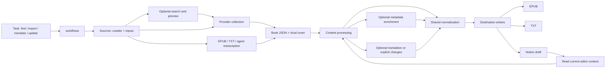

# Architecture

A task can begin with a title, a known URL, local files, or an existing book that
needs a correction. All paths converge on the same book JSON. This is a personal
CLI tool: no workflow engine, service layer, compatibility facade or second
content format is required.

These are six logical responsibilities, not six mandatory sequential steps.
The workflow composes ordinary functions. A correction reads current content,
checks the target fingerprint and normalizes only its replacement. Translation
retains its method-specific QA artifacts but reads and produces the same content
JSON as imports.

| Responsibility | Modules under `src/` | Public seam |
| --- | --- | --- |
| Workflows | `workflows/` | `prepare_book`, `prepare_file`, `collect_source`, `update_book`, `write_book`, translation orchestration |
| Sources | `crawler/`, `inputs/` | `ParserSpec.crawl`, optional search/preview, `read_input` |
| Processing | `content/`, `translation/` | `normalize_book`, `apply_changes`, `translated_source` |
| Metadata | `metadata/` | `enrich_source`, authoritative lookup/classification |
| Destinations | `epub/`, `notion/`, `dataset/text.py` | EPUB/TXT renderers; Notion upload, current-content export, update/readback |
| Contracts | `content/book.schema.json`, `content/contract.py` | Strict book and change validation; chapter/block definitions shared by both |

`cli/` parses arguments. `runtime/` contains paths, hashing, atomic JSON files and
progress. Production never imports `research/`; targeted dataset bookkeeping is
an optional consumer of TXT, selected with `--dataset-root`. Plain TXT output
does not trigger dataset classification or network metadata lookup.

## Shared content

See [content-json.md](content-json.md) for supported fields and change examples.
A run contains `source.json`, an optional relative cover asset, and separate
`report.json` / `evidence.json` files. Platform responses, comments, normalization
findings and Notion transport IDs are not added to the public content contract.
Notion's internal checkpoint stores its own page IDs and progress alongside a
copy of the content; `book-notion export` strips that transport state.

The source JSON is the reusable intermediate output. An EPUB is a destination,
not a mandatory preparation artifact. EPUB 2, EPUB 3, downloaded editions and
existing local EPUBs all use `inputs/epub.py`. Ambiguous spine/navigation coverage
is resolved by an exhaustive reviewed range map, not by a second legacy parser.
Images and irregular text can be parsed in an agent session into the same schema;
see the [image workflow](../.agents/skills/book-management/references/image-transcription.md).

Normalization follows [normalization.md](normalization.md), operating on text
and rich-text blocks. Uncertain findings stay in its report. It never invents
chapter boundaries, silently removes uncertain content, searches the web, or
round-trips through EPUB/Notion. Metadata enrichment fills missing values only;
explicit overrides and original metadata remain authoritative. Preparation
caches bind input bytes, rules, implementation and options, and verify cover
assets on resume. Changing those inputs requires a fresh run directory.

## Sources and Patreon

Search and collection are independent capabilities. `ParserSpec.searchable`
controls discovery; known source URLs/IDs go straight to collection. Previews
must not fetch the full book. Patreon has collection support and no search.
Both `book-crawl` and `book-ingest` call the same registered collector.

Patreon owns authentication/profile handling, platform APIs, post parsing and
comment pagination/deduplication. It returns platform metadata, stable post IDs,
chapter content and optional evidence. Book title/author overrides, source
language, required comments and explicit supplementary post IDs belong to
`book_specs/<book>/config.json` or task options. It does not scan the creator's
feed for similarly numbered chapters. Required comment failures abort collection;
`comments_status=not_requested` is distinct from a successful empty result.
Incomplete/paginated collection membership is rejected instead of exporting a
partial book; a provider extension must handle that response shape explicitly.

The current translation methods translate English to Simplified Chinese and
reject other source languages. That restriction belongs to translation, not
Patreon. Source JSON chapters and independent extras feed the same translation
views; stable source IDs and content hashes support existing delta reuse.
Comments remain review evidence and never enter prompts as instructions.
Configured comment authorities and reviewed glossaries belong to the book spec.

## Changes and destination guarantees

A change task contains explicit chapter replacement/addition, independent extra,
metadata or outline operations. Replacement requires the current chapter hash.
Partial images must first be reconciled into a complete replacement chapter;
untargeted chapters are never normalized or replaced as a side effect.

Local updates produce a new JSON in a fresh run directory, then optionally EPUB
or TXT. Notion updates support chapter replacement/addition and independent
extras. Catalog/outline edits are rejected by that adapter until implemented.
Each run freshly reads editor content. A journal binds task ID, request, book
and destination, records partial writes and permits resuming a body/title write
independently. Conflicting editor changes stop the task. Notion has no atomic
compare-and-swap across content and properties: fresh checks and independent
readback detect conflicts but do not make concurrent editing transactional.

Notion additions reuse duplicate review, uncertain-create recovery, author/work
linking and complete-content readback. A lost create response never triggers
blind recreation. Manual view order is verified; if an append lands at the top,
reorder the existing rows through the browser and resume the same checkpoint.
Shared-extra reuse preserves all existing work relations.

Destination capability checks run before selected writes. Notion rejects rich
content it cannot preserve, including bilingual language/variant annotations
and unsupported directory depth. TXT is the plain-text projection; EPUB retains
rich formatting and language annotations. Writers never run source cleanup.
EPUB creation validates ZIP/XML/navigation before atomic installation. Native
covers are thumbnails, with no separate reading page.

Notion covers use the API when configured, otherwise the maintained
[browser cover procedure](../.agents/skills/book-management/references/notion-cover.md).
Content progress and pending cover work are separate, so retries do not recreate
chapters. Completion requires readback of the prepared cover bytes.

## Maintained commands

| Intent | Command |
| --- | --- |
| Search or acquire, then output | `book-ingest --search TITLE --mode epub` / `book-ingest URL --mode txt` |
| Collect once for later tasks | `book-crawl URL --provider patreon --output generated/crawls/run` |
| Prepare files/agent JSON | `book-prepare FILE --run-dir generated/ingest/run` |
| Inspect ambiguous EPUB | `book-prepare FILE --inventory --run-dir generated/ingest/review` |
| Apply local explicit changes | `book-update source.json --change change.json --run-dir generated/updates/run` |
| Read/edit existing Notion content | `book-notion export` / `book-notion update` |
| Translate and verify | `book-translate prepare`, `scene-positive`, `validate`, `transfer-style`, `build-epub` |
| Repair an existing archive explicitly | `book-normalize`, `book-enrich-metadata` |

Removed: `book-to-epub`, the legacy EPUB preparation workflow, render-to-parse
preparation, raw crawler TXT export, the crawler-specific manifest/chapter
snapshot format and the separate bilingual EPUB writer. Existing generated
artifacts remain untouched; new runs use the shared contract. Do not reintroduce
old-format adapters merely to make historical run scripts work.
Historical translation baselines must first be extracted/reviewed into shared
source JSON with matching chapter identities and paragraph coverage; the old
snapshot directory is not a valid input to the new translation commands.

`tests/test_architecture.py` enforces dependency direction. Fixture tests cover
collection/preparation/output, fragment EPUBs, rich text, normalization rules,
translation/protected quotations, stale changes, interrupted writes and readback.
Live Notion/browser actions are separate, authorized operational checks; unit
fixtures do not imply a live upload has been verified.
