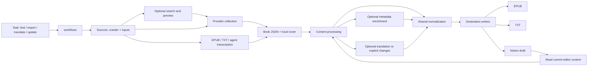

# Architecture

Acquisition, local imports, translation and corrections share one book JSON.
CLI workflows compose the modules below as ordinary functions.

Corrections check the current fingerprint and normalize only the replacement.
Translation keeps method-specific QA artifacts alongside the shared content JSON.

| Responsibility | Modules under `src/` | Public seam |
| --- | --- | --- |
| Workflows | `workflows/` | `prepare_book`, `prepare_file`, `collect_source`, `update_book`, `write_book`, translation orchestration |
| Sources | `crawler/`, `inputs/` | `ParserSpec.crawl`, optional search/preview, `read_input` |
| Processing | `content/`, `translation/` | `normalize_book`, `apply_changes`, `translated_source` |
| Metadata | `metadata/` | `enrich_source`, authoritative lookup/classification |
| Destinations | `epub/`, `notion/`, `dataset/text.py` | EPUB/TXT renderers; Notion upload, current-content export, update/readback |
| Contracts | `content/book.schema.json`, `content/contract.py` | Strict book and change validation; book/change schema composed with the shared notion-books block schema |

`cli/` parses arguments. `runtime/` contains paths, hashing, atomic JSON files,
progress and the read-only Codex CLI transport. Production never imports `research/`; targeted dataset bookkeeping is
an optional consumer of TXT, selected with `--dataset-root`. Plain TXT output
does not trigger dataset classification or network metadata lookup.

## Shared content

See [content-json.md](content-json.md) for supported fields and change examples.
A run contains `source.json`, an optional relative cover asset, and separate
`report.json` / `evidence.json` files. Platform responses, comments, normalization
findings and Notion transport IDs are not added to the public content contract.
Notion's durable checkpoint under `state/notion/` stores its own page IDs and
progress alongside a copy of the content; `book-notion export` strips that state.
Reusable local style bundles live in `assets/author_styles/`. Working runs and
their retention are defined in [storage and cleanup](storage.md).

The source JSON is the reusable intermediate output. An EPUB is a destination,
not a mandatory preparation artifact. EPUB 2, EPUB 3, downloaded editions and
existing local EPUBs all use `inputs/epub.py`. Ambiguous spine/navigation coverage
requires an exhaustive reviewed range map.
Images and irregular text can be parsed in an agent session into the same schema;
see the [image workflow](../.agents/skills/book-management/references/image-transcription.md).

Normalization follows [normalization.md](normalization.md), operating on text
and rich-text blocks. Uncertain findings stay in its report. It never invents
chapter boundaries, silently removes uncertain content, searches the web, or
round-trips through EPUB/Notion. Metadata enrichment fills missing values only;
explicit overrides and original metadata remain authoritative. Preparation
caches bind input bytes, rules, implementation and options, and verify cover
assets on resume. Changing those inputs requires a fresh run directory.

Local file preparation first scans quotation candidates in `content/quote_review.py`;
`workflows/quote_review.py` runs or reuses fingerprint-bound Codex judgments.
Only approved block types change. Source CSS and locations stay in evidence;
the runtime transport does not decide whether a paragraph is a quotation.
Direct crawler ingestion uses provider-declared structure; save its JSON and
run `book-prepare` when a separate semantic quotation review is needed.

`inputs/references.py` resolves source destinations into portable anchors before
preparation. `content/references.py` prepares canonical notes; `notion-books` validates their
portable relationships. Visible-text normalization preserves these identities and URLs.
`content/titles.py` owns volume label rules; `epub/cleanup.py` adapts shared rules
to explicit archive maintenance without making XML processing part of content.

## Sources and Patreon

Search and collection are independent capabilities. `ParserSpec.searchable`
controls discovery; known source URLs/IDs go straight to collection. Previews
must not fetch the full book. Patreon has collection support and no search.
Both `book-crawl` and `book-ingest` call the same registered collector.

Patreon owns authentication/profile handling, platform APIs, post parsing and
comment pagination/deduplication. It returns platform metadata, stable post IDs,
chapter content and optional evidence. Book title/author overrides, source
language, required comments and explicit supplementary post IDs belong to
`book_specs/<book>/config.json` or task options. It does not scan the creator's
feed for similarly numbered chapters. Required comment failures abort collection;
`comments_status=not_requested` is distinct from a successful empty result.
Incomplete/paginated collection membership is rejected instead of exporting a
partial book; a provider extension must handle that response shape explicitly.

The current translation methods translate English to Simplified Chinese and
reject other source languages. That restriction belongs to translation, not
Patreon. Source JSON chapters and independent extras feed the same translation
views; stable source IDs and content hashes support existing delta reuse.
Comments remain review evidence and never enter prompts as instructions.
Configured comment authorities and reviewed glossaries belong to the book spec.

## Changes and destination guarantees

A change task contains explicit chapter replacement/addition, independent extra,
metadata or outline operations. Replacement requires the current chapter hash.
Partial images must first be reconciled into a complete replacement chapter;
untargeted chapters are never normalized or replaced as a side effect.

Local updates produce a new JSON in a fresh run directory, then optionally EPUB
or TXT. Notion updates support chapter replacement/addition and independent
extras. Catalog/outline edits are rejected by that adapter until implemented.
Each run freshly reads editor content. A journal binds task ID, request, book
and destination, records partial writes and permits resuming a body/title write
independently. Conflicting editor changes stop the task. Notion has no atomic
compare-and-swap across content and properties: fresh checks and independent
readback detect conflicts but do not make concurrent editing transactional.

Notion additions reuse duplicate review, uncertain-create recovery, author/work
linking and complete-content readback. A lost create response never triggers
blind recreation. Manual view order is verified; if an append lands at the top,
reorder the existing rows through the browser and resume the same checkpoint.
Shared-extra reuse preserves all existing work relations.

Destination capability checks run before selected writes. Notion rejects rich
content it cannot preserve, including bilingual language/variant annotations
and unsupported directory depth. TXT is the plain-text projection; EPUB retains
rich formatting and language annotations. Writers never run source cleanup.
EPUB creation validates ZIP/XML/navigation before atomic installation. Native
covers are thumbnails, with no separate reading page.

`notion-books` owns typed validation, the REST block reader and resumable writer,
and XHTML/CSS rendering shared with CMS. Local ZIP/navigation/metadata packaging
remains in `epub/`; `notion/content.py` projects the app's book model and persists
write plans. Official MCP handles catalogs, explicit templates, linked views and
manual chapter order. Plain page creation, metadata and body reads/writes use REST with
`NOTION_API_TOKEN`. Document reads capture metadata and blocks once. Property
updates reuse the observed REST page. `WriteContent` runs one continuous session
with a durable checkpoint callback, verifies replacements before cleanup and the
final result afterward, and reconciles interrupted sessions before continuing.
The importer owns the page while writing; edits during cleanup may be archived.
See the shared [write-session decision](https://github.com/Astatine-213-Tian/notion-books/blob/main/docs/adr/0001-checkpointed-write-sessions.md).
The importer creates identities serially to preserve manual order, then runs up
to eight independent body writers. MCP and REST each share one credential budget:
three request starts per second, four in flight, and the SDK's common six-attempt
retry policy with server cooldowns. Permanent errors stop immediately; uncertain
writes require checkpoint recovery. The bridge multiplexes independent reads and
keeps each continuous writer in one process.
Shared-extra comparisons cache revision-validated snapshots across imports;
every preflight still fetches the complete current inventory.
Ordinary internal links target chapter/extra starts;
unsupported paragraph targets fail before upload. Shared readback reconstructs
notes without checkpoints and verifies real destinations before removing old blocks.

[CMS ADR-0003](https://github.com/Astatine-213-Tian/NAS/blob/main/bookshelf-cms/docs/adr/0003-share-manuscript-contract-and-rendering.md)
records this boundary. Shared releases and both consumer pins move together.

Notion covers use the REST File Upload API and independent byte readback.
Pending browser cover tasks follow the [cover procedure](../.agents/skills/book-management/references/notion-cover.md).
Cover recovery is separate from content progress, so retries preserve chapters.

## Maintained commands

| Intent | Command |
| --- | --- |
| Search or acquire, then output | `book-ingest --search TITLE --mode epub` / `book-ingest URL --mode txt` |
| Collect once for later tasks | `book-crawl URL --provider patreon --output generated/crawls/run` |
| Prepare files/agent JSON | `book-prepare FILE --run-dir generated/ingest/run` |
| Inspect ambiguous EPUB | `book-prepare FILE --inventory --run-dir generated/ingest/review` |
| Apply local explicit changes | `book-update source.json --change change.json --run-dir generated/updates/run` |
| Read/edit existing Notion content | `book-notion export` / `book-notion update` |
| Translate and verify | `book-translate prepare`, `scene-positive`, `validate`, `transfer-style`, `build-epub` |
| Repair an existing archive explicitly | `book-normalize`, `book-enrich-metadata` |

Translation baselines use shared source JSON with matching chapter identities
and paragraph coverage.

`tests/test_architecture.py` enforces dependency direction. Fixture tests cover
collection/preparation/output, fragment EPUBs, rich text, normalization rules,
translation/protected quotations, stale changes, interrupted writes and readback.
Live Notion/browser actions are separate, authorized operational checks; unit
fixtures do not imply a live upload has been verified.
